# Kometa Overlay Stack

Complete Plex overlay pipeline: **posterizarr → UMTK → animetafill → Kometa → imageMaid**.

This single repo replaces the deprecated [kometa-overlay-configs](https://github.com/Naveen11695/kometa-overlay-configs) and [kometa-overlay-assets](https://github.com/Naveen11695/kometa-overlay-assets) repos with production-accurate YAML, image assets, UMTK snapshots (overlays + collections), Docker compose templates, and full pipeline documentation.

## Table of Contents

- [Architecture](#architecture)
- [Screenshots](#screenshots)
- [Overlay Anatomy](#overlay-anatomy)
- [Anime Poster Anatomy](#anime-poster-anatomy)
- [Episode Title Card Anatomy](#episode-title-card-anatomy)
- [Collections](#collections)
- [Sources & Credits](#sources--credits)
- [What's customized vs upstream](#whats-customized-vs-upstream)
- [Prerequisites](#prerequisites)
- [Setup guide](#setup-guide)
- [Production overlay wiring](#production-overlay-wiring)
- [Optional / inactive overlays](#optional--inactive-overlays)
- [Generated vs static files](#generated-vs-static-files)
- [Troubleshooting](#troubleshooting)
- [Security](#security)

## Architecture

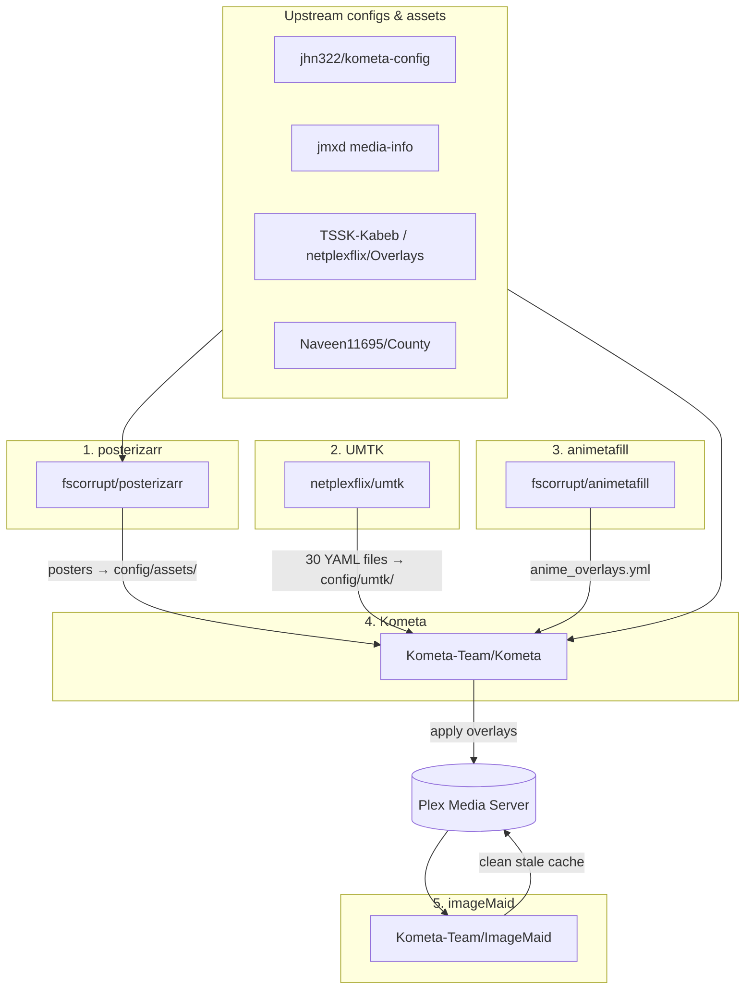

See [docs/PIPELINE.md](docs/PIPELINE.md) for detailed stage descriptions and volume layout.

## Screenshots

### Movies

4K/HDR badges, NEW ribbon, IMDb ratings, and media-info bar (DIGITAL+, codec, resolution).

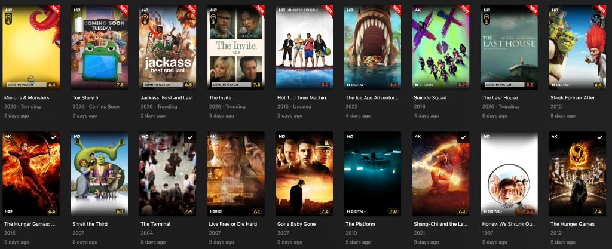

### Shows

Streaming network logos, RETURNING/ENDED status ribbons, GRAB TO WATCH banner, and ratings.

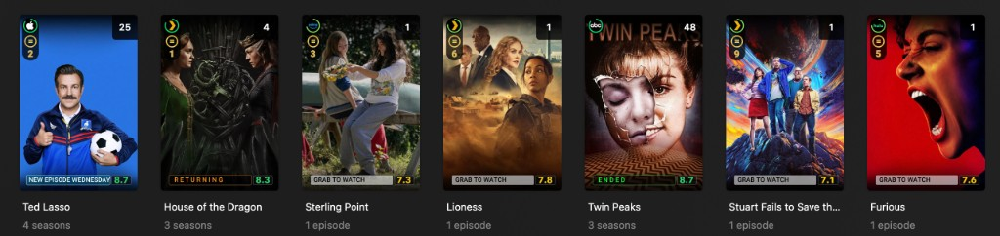

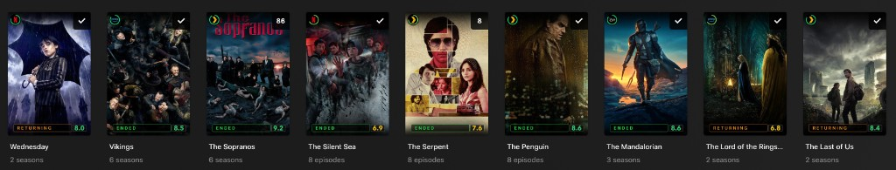

### Anime

Series-level ratings and ENDED status.

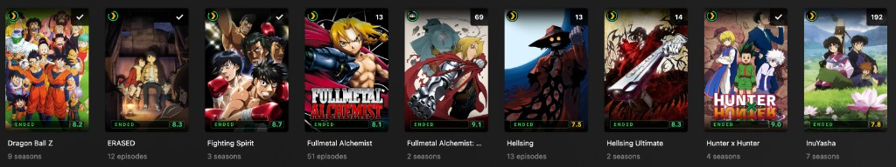

### Anime Episodes

Canon/filler tags, season/episode labels, and per-episode ratings.

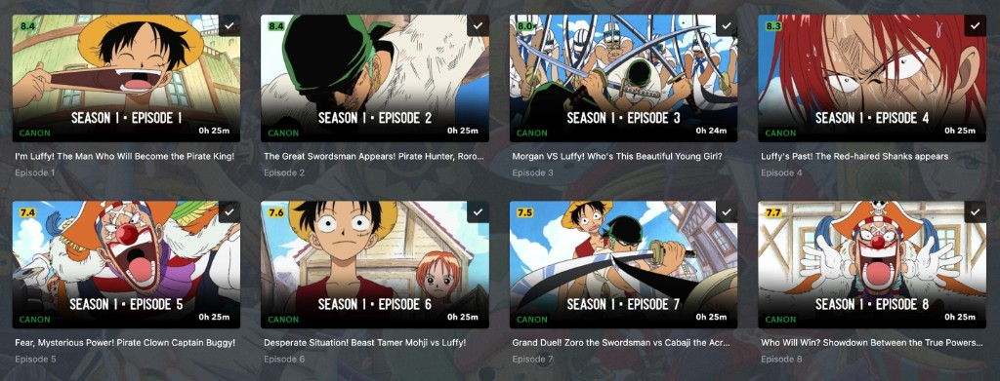

## Overlay Anatomy

Annotated example of a movie poster with multiple overlays applied (*Lord of the Rings: The Fellowship of the Ring*):

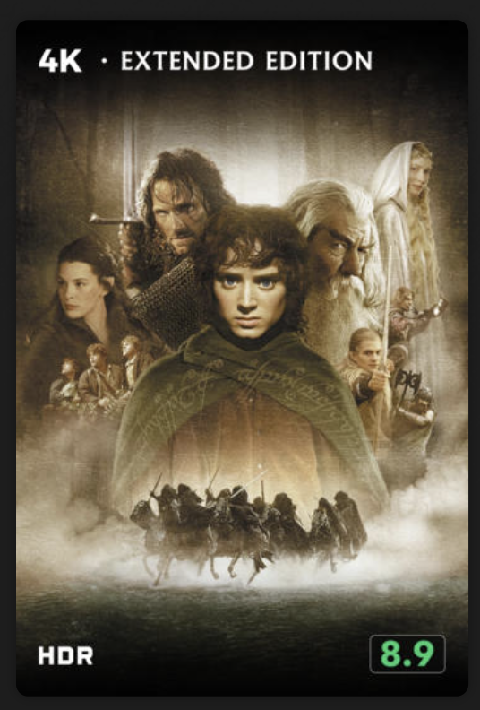

| Badge | Location | What it shows | Config file | Source |
|-------|----------|---------------|-------------|--------|
| 4K | Top-left | 4K/UHD resolution | `overlays/movies/4k.yml` **or** active: `media_info` detects from filename | [jhn322](https://github.com/jhn322/kometa-config) / [jmxd](https://github.com/jmxd/Kometa) |
| EXTENDED EDITION | Top-center | Edition type from filename | `overlays/movies/media_info.yml` | [jmxd/Kometa](https://github.com/jmxd/Kometa) |
| HDR | Bottom-left | HDR dynamic range | `overlays/movies/4k.yml` or `media_info` | [jhn322](https://github.com/jhn322/kometa-config) |
| 8.9 | Bottom-right | IMDb/audience rating (green = fresh) | `overlays/movies/audience_rating.yml` | jhn322 + user customized |

**What this screenshot shows vs. production wiring**

On this poster, the **4K**, **EXTENDED EDITION**, and **HDR** badges all come from the jmxd **media_info** bar (`config/3-media_info.yml` → `overlays/movies/media_info.yml`), which reads resolution, edition, and HDR from the TRaSH-style filename. The **8.9** score is from the customized audience-rating overlay (`config/3-audience_rating.yml` → `overlays/movies/audience_rating.yml`).

In **production**, Movies does **not** load the standalone `4k.yml` pack (`3.1-Movies_Overlays_4K.yml`). Active overlays are **media_info**, **audience_rating**, **UMTK** (Coming Soon, trending top-10), and **recently_added** (NEW ribbon). See [Production overlay wiring](#production-overlay-wiring). To use the separate jhn322 4K/HDR badge images instead of (or alongside) media_info, add `overlays/movies/4k.yml` to `overlay_files` — see [Optional / inactive overlays](#optional--inactive-overlays).

## Anime Poster Anatomy

Annotated example of an anime series poster with overlays applied (*Jujutsu Kaisen*):

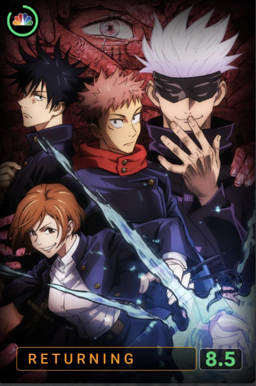

| Badge | Location | What it shows | Config file | Source |
|-------|----------|---------------|-------------|--------|
| NBC/Peacock logo | Top-left | Streaming network logo | `overlays/networks/TSSK-Kabeb.yml` | [netplexflix/Overlays](https://github.com/netplexflix/Overlays) |
| Green ring/check | Top-left (around logo) | Watch progress or network badge accent | `overlays/networks/TSSK-Kabeb.yml` | [netplexflix/Overlays](https://github.com/netplexflix/Overlays) |
| RETURNING | Bottom-left | Show status ribbon (orange) | `umtk/TSSK_TV_RETURNING_OVERLAYS.yml` | UMTK generated |
| 8.5 | Bottom-right | Rating chip (green) | `overlays/movies/audience_rating.yml` (`3-audience_rating.yml`) | [jhn322](https://github.com/jhn322/kometa-config) + customized |

**What this screenshot shows vs. production wiring**

**TSSK-Kabeb** (`config/TSSK-Kabeb.yml`) provides the streaming network logos and badge accents in the top-left. **UMTK** generates status ribbons dynamically — RETURNING, ENDED, NEW, and other TV status overlays are written to `config/umtk/` on each UMTK run (this poster shows the RETURNING ribbon from `TSSK_TV_RETURNING_OVERLAYS.yml`). The **8.5** score comes from the customized audience-rating overlay shared across Shows and Anime libraries. See [Production overlay wiring](#production-overlay-wiring).

## Episode Title Card Anatomy

Annotated example of an episode title card with overlays applied (*House of the Dragon* S1E1). The base title card artwork is generated by [posterizarr](https://github.com/fscorrupt/posterizarr); Kometa applies the rating and runtime overlays on top.

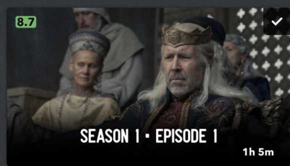

| Badge | Location | What it shows | Source |
|-------|----------|---------------|--------|
| 8.7 | Top-left | Episode rating (green chip) | `overlays/movies/audience_rating_episodes.yml` (`3-audience_rating_episodes.yml`) |
| ✓ checkmark | Top-right | Watched status | Kometa built-in or posterizarr |
| SEASON 1 • EPISODE 1 | Bottom-center | Episode label | posterizarr title cards or Kometa |
| 1h 5m | Bottom-right | Runtime | `default: runtimes` (inline in `config.yml`) or `overlays/shared/runtime.yml` |

## Collections

Kometa collections are separate from overlay badges but part of the full Plex experience. Collection YAML files come from [jhn322/kometa-config](https://github.com/jhn322/kometa-config) and are partially customized in production (chart thresholds, `visible_shared` rotation schedules, Trakt list URLs). Collection poster artwork is generated by [posterizarr](https://github.com/fscorrupt/posterizarr) and stored at `config/posters/` on the Docker host.

This repo ships sanitized collection configs in `collections/` (no credentials). UMTK status/trending collections live in `umtk/collections/`.

### TV / Show collections

Genres, streaming services (via `3-Movies_Studios.yml` on the Shows library), franchises, awards, and IMDb/Rotten Tomatoes chart lists.

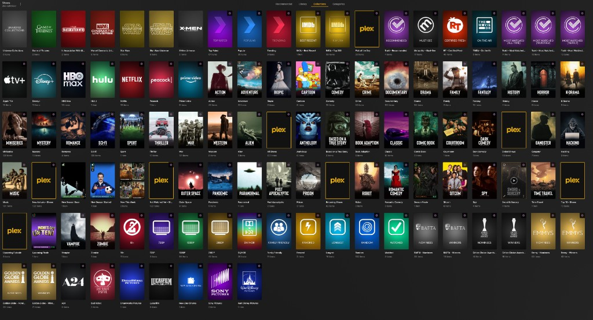

| File | Contents |
|------|----------|
| `7-TV.yml` | Chart lists — IMDb Top 250, Popular, Trending, Trakt Most Watched |
| `7-TV_Genres.yml` | Genre smart collections |
| `7-TV_Awards.yml` | Emmy, Golden Globe, and other award winners |
| `7-TV_Franchises.yml` | TV franchise groupings |
| `7-TV_Networks.yml` | Network-based collections |
| `7-TV_Specials.yml` | Themes, decades, and curated specials |
| `3-Movies_Studios.yml` | Streaming service collections (Netflix, HBO, Disney+, etc.) |

### Movie collections

Genres, streaming/studio collections, franchises, IMDb/Trakt/Letterboxd charts, and themed specials.

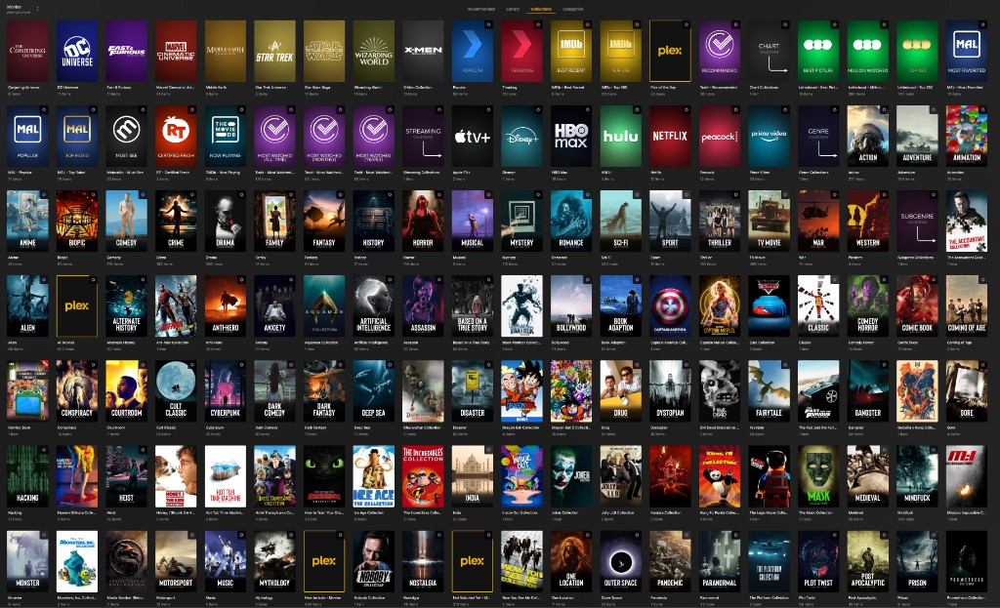

| File | Contents |
|------|----------|
| `3-Movies.yml` | Chart lists — IMDb Top 250, Letterboxd Top 250, Trakt Most Watched, Trending |
| `3-Movies_Genres.yml` | Genre smart collections |
| `3-Movies_Franchises.yml` | Movie franchise groupings |
| `3-Movies_Studios.yml` | Studio and streaming collections |
| `3-Movies_People.yml` | Actor, director, and author collections |
| `3-Movies_Awards.yml` | Oscar, BAFTA, and other award winners |
| `3-Movies_Holidays.yml` | Holiday-themed collections |
| `3-Movies_Specials.yml` | Curated themes and decade collections |

### Actor collections

Actor/director collections with custom black-and-white poster artwork from posterizarr (`config/posters/*.jpg`).

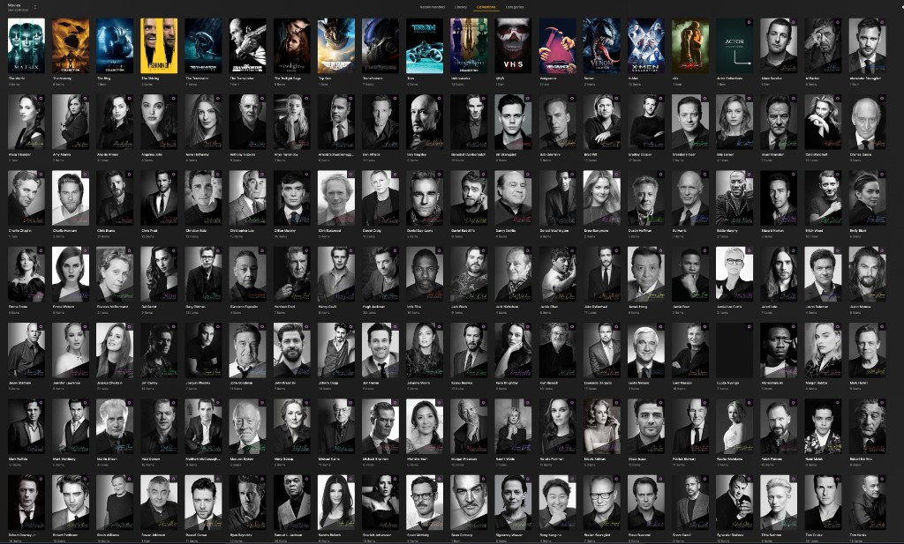

Defined in `collections/3-Movies_People.yml`. Each collection uses `file_poster: config/posters/<Name>.jpg` pointing to posterizarr-generated artwork.

### Anime collections

| File | Contents |
|------|----------|
| `1-Anime.yml` | MAL chart lists — Top Airing, Popular, Trending |
| `1-Anime_Genres.yml` | Anime genre collections |
| `1-Anime_Franchises.yml` | Anime franchise groupings |
| `1-Anime_Networks.yml` | Simulcast network collections |
| `1-Anime_Years.yml` | Year-based collections |

Wire collections in `config.yml` under each library's `collection_files`. See `config.example.yml` for production wiring. Copy collection YAMLs to `config/` on your Docker host:

```bash
cp -r $STACK/collections/* $CONFIG/
cp -r $STACK/umtk/collections/* $CONFIG/umtk/
```

## Sources & Credits

| Project | Repo | What it provides |
|---------|------|------------------|
| **posterizarr** | [fscorrupt/posterizarr](https://github.com/fscorrupt/posterizarr) | Custom poster/backdrop artwork |
| **animetafill** | [fscorrupt/AniMetaFill](https://github.com/fscorrupt/AniMetaFill) | Canon/filler episode overlay generation |
| **ImageMaid** | [Kometa-Team/ImageMaid](https://github.com/Kometa-Team/ImageMaid) | Plex poster cache cleanup |
| **Kometa** | [Kometa-Team/Kometa](https://github.com/Kometa-Team/Kometa) | Overlay application engine |
| **jmxd overlays** | [jmxd/Kometa](https://github.com/jmxd/Kometa) | Media-info bar templates |
| **jhn322 config** | [jhn322/kometa-config](https://github.com/jhn322/kometa-config) | Base config structure and flat overlay naming |
| **UMTK** | [netplexflix/Upcoming-Movies-TV-Shows-for-Kometa](https://github.com/netplexflix/Upcoming-Movies-TV-Shows-for-Kometa) | Status ribbons, trending, Coming Soon (15 overlays + 15 collections) |
| **TSSK-Kabeb** | [netplexflix/Overlays](https://github.com/netplexflix/Overlays) | Network logos and Kabeb badge artwork |
| **County** | [Naveen11695/County](https://github.com/Naveen11695/County) | Movie trending top-10 badge images |

**Not used:** standalone [netplexflix/Overlays](https://github.com/netplexflix/Overlays) container (UMTK manages Kabeb), [quickStartKometa](https://github.com/netplexflix/quickStartKometa).

Full attribution table: [docs/SOURCES.md](docs/SOURCES.md)

## What's customized vs upstream

- **Overlay YAML** — sourced from jhn322/jmxd, reorganized into `overlays/` tree; production uses flat `config/` paths ([mapping](docs/MAPPING.md))
- **Assets** — jmxd badges, TSSK-Kabeb logos, County trending images bundled in `assets/`
- **UMTK** — 30 generated files snapshotted in `umtk/overlays/` and `umtk/collections/` (collections were missing from old published repo)
- **Collections** — jhn322 chart/genre/franchise YAMLs in `collections/`; posterizarr artwork at `config/posters/` on Docker host
- **Library names** — `Movies`, `Shows`, `Anime` (not "TV Shows")
- **Anime** — live `animetafill/anime_overlays.yml` in production; static `anime/canon_filler.example.yml` as fallback
- **Docker** — Synology `/volume2/docker/` volume paths

## Prerequisites

- [Plex Media Server](https://www.plex.tv/) with libraries named **Movies**, **Shows**, **Anime**
- [Docker](https://www.docker.com/) (Synology Container Manager or Linux)
- [TMDb API key](https://www.themoviedb.org/settings/api) (free)
- Plex server URL and [authentication token](https://support.plex.tv/articles/204059436-finding-an-authentication-token-x-plex-token/)

**For UMTK:**

- [Sonarr](https://sonarr.tv/) and [Radarr](https://radarr.video/) API keys
- [MDBList API key](https://mdblist.com/) for trending top-10
- Media folders for upcoming placeholders (`Upcoming_Movie`, `Upcoming_Shows`)

**For animetafill:**

- Sonarr API key (recommended for episode mapping)
- [SIMKL client ID](https://simkl.com/settings/developer/) (free)

**For posterizarr:**

- TMDb, TVDB, Fanart.tv API keys (configured in posterizarr UI)

## Setup guide

### 1. Clone the repo

```bash
git clone https://github.com/Naveen11695/kometa-overlay-stack.git /tmp/kometa-overlay-stack
```

### 2. Create directory layout on Synology

```bash
# Kometa
mkdir -p /volume2/docker/kometa/config/{umtk,animetafill,overlays,assets,logs}

# Generator services
mkdir -p /volume2/docker/UMTK/{config,video}
mkdir -p /volume2/docker/animetafill/{data,logs}
mkdir -p /volume2/docker/posterizarr/{config,assetsbackup,manualassets}
mkdir -p /volume2/docker/imageMaid/config

# UMTK upcoming media placeholders
mkdir -p /volume1/media/Upcoming_Movie /volume1/media/Upcoming_Shows
```

### 3. Copy repo contents into Kometa config

```bash
STACK=/tmp/kometa-overlay-stack
CONFIG=/volume2/docker/kometa/config

# Overlay YAML (tree layout)
cp -r $STACK/overlays $CONFIG/

# Image assets (PNG, fonts) — merge into overlays/
cp -r $STACK/assets/. $CONFIG/overlays/

# UMTK snapshots (or let UMTK container generate live)
cp -r $STACK/umtk/overlays/* $CONFIG/umtk/
cp -r $STACK/umtk/collections/* $CONFIG/umtk/

# jhn322 collection YAMLs
cp -r $STACK/collections/* $CONFIG/

# Optional: flat jhn322 symlinks for production-style paths
cd $CONFIG
ln -sf overlays/movies/media_info.yml 3-media_info.yml
ln -sf overlays/tv/media_info.yml 3-media_info_shows.yml
ln -sf overlays/movies/audience_rating.yml 3-audience_rating.yml
ln -sf overlays/movies/audience_rating_episodes.yml 3-audience_rating_episodes.yml
ln -sf overlays/shared/recently_added.yml recently_added.yml
ln -sf overlays/networks/TSSK-Kabeb.yml TSSK-Kabeb.yml
```

### 4. Create config.yml

```bash
cp $STACK/config.example.yml $CONFIG/config.yml
```

Edit `config.yml` — replace placeholders:

| Field | Where to get it |
|-------|-----------------|
| `plex.url` | `http://YOUR_PLEX_IP:32400` |
| `plex.token` | [Plex token](https://support.plex.tv/articles/204059436-finding-an-authentication-token-x-plex-token/) |
| `tmdb.apikey` | [TMDb API settings](https://www.themoviedb.org/settings/api) |
| `mdblist.apikey` | [MDBList](https://mdblist.com/) (for UMTK trending) |

Verify library names are exactly `Movies`, `Shows`, `Anime`.

### 5. Configure and start each Docker service (in order)

Copy compose files from `docker/` and adjust `PUID`, `PGID`, `TZ`, and volume paths.

**5a. posterizarr**

```bash
cp $STACK/docker/posterizarr.compose.yml /volume2/docker/posterizarr/compose.yaml
cd /volume2/docker/posterizarr && docker compose up -d
```

Configure API keys via Web UI at `http://YOUR_HOST:8219`.

**5b. UMTK**

```bash
cp $STACK/docker/umtk.compose.yml /volume2/docker/UMTK/compose.yaml
```

Create `/volume2/docker/UMTK/config/config.yml` from the [UMTK configuration docs](https://github.com/netplexflix/Upcoming-Movies-TV-Shows-for-Kometa#configuration). Key settings:

```yaml
enable_umtk: true
enable_tssk: true
plex_url: 'http://YOUR_PLEX_IP:32400'
plex_token: 'YOUR_PLEX_TOKEN'
movie_libraries: 'Movies'
tv_libraries: 'Anime,Shows'
mdblist_api_key: 'YOUR_MDBLIST_API_KEY'
```

```bash
cd /volume2/docker/UMTK && docker compose up -d
```

Wait for first run (Web UI at `:2120`) — confirms 30 files in `kometa/config/umtk/`.

**5c. animetafill**

```bash
cp $STACK/docker/animetafill.compose.yml /volume2/docker/animetafill/compose.yaml
```

Create `/volume2/docker/animetafill/config.yml` from the [animetafill repo](https://github.com/fscorrupt/AniMetaFill):

```yaml
plex:
  url: "http://YOUR_PLEX_IP:32400"
  token: "YOUR_PLEX_TOKEN"
  libraries:
    - "Anime"
sonarr:
  url: "http://YOUR_SONARR_IP:7878"
  api_key: "YOUR_SONARR_API_KEY"
simkl:
  client_id: "YOUR_SIMKL_CLIENT_ID"
kometa:
  output_dir: "/data/kometa_overlays"
  font_path: "config/overlays/fonts/Colus-Regular.ttf"
```

```bash
cd /volume2/docker/animetafill && docker compose up -d
```

**5d. Kometa**

```bash
cp $STACK/docker/kometa.compose.yml /volume2/docker/kometa/docker-compose.yml
cd /volume2/docker/kometa && docker compose up -d
```

First run: `docker compose run --rm kometa`

**5e. imageMaid**

```bash
cp $STACK/docker/imagemaid.compose.yml /volume2/docker/imageMaid/compose.yaml
```

Create `/volume2/docker/imageMaid/config/.env`:

```env
MODE=remove
PLEX_URL=http://YOUR_PLEX_IP:32400
PLEX_TOKEN=YOUR_PLEX_TOKEN
SCHEDULE=04:30|weekly(sunday)|mode=clear
TIMEOUT=600
SLEEP=60
EMPTY_TRASH=True
CLEAN_BUNDLES=True
OPTIMIZE_DB=True
```

```bash
cd /volume2/docker/imageMaid && docker compose up -d
```

## Production overlay wiring

Active `overlay_files` per library (from live production `config.yml`):

### Movies

| Overlay | Path |
|---------|------|
| Media info bar | `config/3-media_info.yml` |
| Coming Soon | `config/umtk/UMTK_MOVIES_UPCOMING_OVERLAYS.yml` |
| Trending top-10 | `config/umtk/UMTK_MOVIES_TOP10_OVERLAYS.yml` |
| Audience rating | `config/3-audience_rating.yml` |
| Recently added (NEW) | `config/recently_added.yml` |

### Shows

| Overlay | Path |
|---------|------|
| Media info bar | `config/3-media_info_shows.yml` |
| Coming Soon | `config/umtk/UMTK_TV_UPCOMING_SHOWS_OVERLAYS.yml` |
| Trending top-10 | `config/umtk/UMTK_TV_TOP10_OVERLAYS.yml` |
| New season | `config/umtk/TSSK_TV_NEW_SEASON_OVERLAYS.yml` |
| Upcoming episode | `config/umtk/TSSK_TV_UPCOMING_EPISODE_OVERLAYS.yml` |
| Upcoming finale | `config/umtk/TSSK_TV_UPCOMING_FINALE_OVERLAYS.yml` |
| Canceled | `config/umtk/TSSK_TV_CANCELED_OVERLAYS.yml` |
| Ended | `config/umtk/TSSK_TV_ENDED_OVERLAYS.yml` |
| Returning | `config/umtk/TSSK_TV_RETURNING_OVERLAYS.yml` |
| Season finale | `config/umtk/TSSK_TV_SEASON_FINALE_OVERLAYS.yml` |
| Final episode | `config/umtk/TSSK_TV_FINAL_EPISODE_OVERLAYS.yml` |
| New season started | `config/umtk/TSSK_TV_NEW_SEASON_STARTED_OVERLAYS.yml` |
| New show | `config/umtk/TSSK_TV_NEW_SHOW_OVERLAYS.yml` |
| Network logos | `config/TSSK-Kabeb.yml` |
| Audience rating (series) | `config/3-audience_rating.yml` |
| Audience rating (episodes) | `config/3-audience_rating_episodes.yml` |
| Episode runtime | `default: runtimes` |

### Anime

Same as Shows, except:

- No trending top-10 (`UMTK_TV_TOP10_OVERLAYS.yml`)
- Adds `config/animetafill/anime_overlays.yml` (generated by animetafill)
- Episode runtime via `default: runtimes`

Repo tree equivalents: [docs/MAPPING.md](docs/MAPPING.md)

## Optional / inactive overlays

Available in `overlays/` but not active in production:

| Prefix | Library | Files | Repo path |
|--------|---------|-------|-----------|
| `3.1-*` | Movies | 4K, Rating, Subtitle, Top | `overlays/movies/` |
| `7.1-*` | Shows | 4K, Canceled, Rating, Top | `overlays/tv/` |
| `1.1-*` | Anime | Resolution, Rating, ContentRating, Top | `overlays/anime/` |
| `5.1-*` | Remux | Audio, Rating, Top, combined | `overlays/remux/` |

To enable, add the corresponding path to `overlay_files` in `config.yml`. See [docs/MAPPING.md](docs/MAPPING.md) for flat ↔ tree paths.

## Generated vs static files

| File / folder | Type | Updated by |
|---------------|------|------------|
| `config/umtk/*.yml` (30 files) | Generated | UMTK cron |
| `config/animetafill/anime_overlays.yml` | Generated | animetafill schedule |
| `config/assets/` | Generated | posterizarr |
| `overlays/` YAML | Static | git pull from this repo |
| `overlays/` PNG/fonts | Static | git pull from this repo |
| `collections/` YAML | Static | git pull from this repo |
| `config/posters/` | Generated | posterizarr |
| `anime/canon_filler.example.yml` | Static snapshot | Manual only (fallback if animetafill not used) |

## Troubleshooting

### Overlays not showing in Plex

- Check Kometa logs: `docker compose logs kometa` or `config/logs/meta.log`
- Plex caches posters — refresh library or re-run Kometa with `reapply_overlays: true`
- Verify `overlay_files` paths exist under `config/`
- Run imageMaid to clear stale Plex cache

### Wrong library names

Kometa library keys must match Plex exactly. Production uses `Movies`, `Shows`, `Anime` — not `TV Shows`.

### Missing image assets

Kometa logs `File not found` for PNG paths when:

- `assets/` was not copied into `config/overlays/`
- Font path missing (e.g. `config/overlays/fonts/Colus-Regular.ttf`)
- Kabeb network logos need internet access (some load from GitHub raw URLs)

```bash
ls config/overlays/4K-HDR.png
ls config/overlays/images/media_info/
ls config/overlays/fonts/
```

### UMTK not generating files

- Confirm volume mount: `kometa/config/umtk` → `/app/kometa`
- Check Web UI at `:2120` for errors
- Verify Plex, Sonarr, Radarr, MDBList credentials in UMTK `config.yml`

### animetafill not updating

- Confirm output mount: `kometa/config/animetafill` → `/data/kometa_overlays`
- Kometa must reference `config/animetafill/anime_overlays.yml`, not the static fallback
- Re-run Kometa after animetafill completes

### Authentication errors

| Symptom | Fix |
|---------|-----|
| Plex connection failed | Check `plex.url` and `plex.token` |
| TMDb API error | Verify `tmdb.apikey` |
| Sonarr/Radarr errors (UMTK) | Add API keys to UMTK config |
| MDBList trending empty | Verify `mdblist_api_key` in UMTK config |

## Security

This repo contains **no credentials**. Never commit:

- `config.yml` with real API keys or Plex tokens
- UMTK, animetafill, posterizarr, or imageMaid config files with secrets
- `.env` files with Discord webhooks or tokens

The `.gitignore` excludes `config.yml`, `*.env`, logs, cache, and runtime asset directories. Store secrets only on your Docker host.

## Repo structure

```
kometa-overlay-stack/
├── README.md
├── config.example.yml
├── docs/
│   ├── PIPELINE.md
│   ├── SOURCES.md
│   ├── MAPPING.md
│   └── images/           # Screenshots
├── docker/               # Sanitized compose templates
├── collections/          # jhn322 collection YAMLs (movies, tv, anime, people)
├── overlays/             # Static overlay YAML (movies, tv, anime, networks, shared, remux)
├── umtk/
│   ├── overlays/         # UMTK overlay snapshots (15 files)
│   └── collections/      # UMTK collection snapshots (15 files)
├── anime/
│   └── canon_filler.example.yml
└── assets/               # PNG badges, fonts, sprites
```

## License

Overlay configs and assets are derived from upstream community projects — see [docs/SOURCES.md](docs/SOURCES.md) for attribution. Kometa is licensed under the MIT License.
