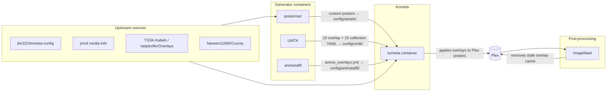

# Pipeline

This document describes the full overlay stack pipeline as deployed in production on Synology NAS (`/volume2/docker/`).

## Overview



## Stage 1: posterizarr

**Image:** `ghcr.io/fscorrupt/posterizarr:latest`  
**Purpose:** Fetches and manages custom poster/backdrop artwork before Kometa applies overlays.

- Writes to `kometa/config/assets/` (Movies, Shows, Anime subfolders)
- Kometa `settings.asset_directory` points at these paths
- Runs first in the pipeline so Kometa has fresh base artwork

**Compose:** `docker/posterizarr.compose.yml`

## Stage 2: UMTK

**Image:** `netplexflix/umtk:latest`  
**Purpose:** Generates dynamic TV/movie status ribbons, trending top-10 badges, and Coming Soon overlays.

UMTK writes **30 files** to the mounted Kometa `umtk/` folder:

| Type | Count | Examples |
|------|-------|---------|
| Overlays | 15 | `TSSK_TV_RETURNING_OVERLAYS.yml`, `UMTK_MOVIES_TOP10_OVERLAYS.yml` |
| Collections | 15 | `TSSK_TV_RETURNING_COLLECTION.yml`, `UMTK_MOVIES_TRENDING_COLLECTION.yml` |

- TSSK (TV Show Status) is integrated into UMTK — no separate TSSK container
- Kabeb network logos reference [netplexflix/Overlays](https://github.com/netplexflix/Overlays) (`TSSK-Kabeb/`)
- Movie trending badges use artwork from [Naveen11695/County](https://github.com/Naveen11695/County)
- **Not used:** standalone [netplexflix/Overlays](https://github.com/netplexflix/Overlays) container or [quickStartKometa](https://github.com/netplexflix/quickStartKometa)

**Compose:** `docker/umtk.compose.yml`  
**Snapshots in repo:** `umtk/overlays/` and `umtk/collections/`

## Stage 3: animetafill

**Image:** `ghcr.io/fscorrupt/animetafill:latest`  
**Purpose:** Scans Plex anime library and generates per-episode canon/filler/mixed overlay YAML.

- Output: `kometa/config/animetafill/anime_overlays.yml`
- Requires Plex token, Sonarr API key (recommended), SIMKL client ID
- Static fallback available: `anime/canon_filler.example.yml` (snapshot, not auto-updated)

**Compose:** `docker/animetafill.compose.yml`

## Stage 4: Kometa

**Image:** `kometateam/kometa:latest`  
**Purpose:** Applies all overlay YAML to Plex poster artwork.

Run order (from `config.yml`):

1. Operations (mass rating updates, asset management)
2. Metadata
3. Collections (including UMTK-generated collections)
4. Overlays (static + generated YAML)

**Compose:** `docker/kometa.compose.yml`

## Stage 5: imageMaid

**Image:** `kometateam/imagemaid`  
**Purpose:** Cleans Plex's local poster cache after overlay changes to prevent stale images.

- Runs on a schedule (configured via `.env`)
- Modes: `remove`, `clear`, `move`, `nothing`
- Mounts Plex Media Server data directory

**Compose:** `docker/imagemaid.compose.yml`

## Recommended startup order

1. **posterizarr** — populate base artwork
2. **UMTK** — generate status/trending YAML (wait for first cron run or trigger via Web UI `:2120`)
3. **animetafill** — generate anime canon/filler YAML (wait for first run)
4. **kometa** — apply collections and overlays
5. **imageMaid** — clean stale Plex cache (scheduled)

## Volume layout (production)

```
/volume2/docker/
├── posterizarr/
│   ├── config/
│   ├── assetsbackup/
│   └── manualassets/
├── UMTK/
│   ├── config/config.yml
│   └── video/
├── animetafill/
│   ├── config.yml
│   ├── data/
│   └── logs/
├── kometa/
│   ├── config/
│   │   ├── config.yml              ← credentials (never commit)
│   │   ├── 3-media_info.yml        ← jhn322 flat overlay files
│   │   ├── umtk/                   ← UMTK generated (30 files)
│   │   ├── animetafill/            ← animetafill generated
│   │   ├── overlays/               ← PNG/fonts from assets/
│   │   └── assets/                 ← posterizarr output
│   └── logs/
└── imageMaid/
    └── config/.env
```

## Generated vs static files

| File / folder | Source | Updated by |
|---------------|--------|------------|
| `config/umtk/*.yml` | UMTK | UMTK cron (every 3h) |
| `config/animetafill/anime_overlays.yml` | animetafill | animetafill schedule |
| `config/assets/` | posterizarr | posterizarr |
| `config/3-*.yml`, `config/TSSK-Kabeb.yml` | This repo (`overlays/`) | Manual git pull |
| `config/overlays/` (PNG/fonts) | This repo (`assets/`) | Manual git pull |
| `anime/canon_filler.example.yml` | This repo | Static snapshot only |
